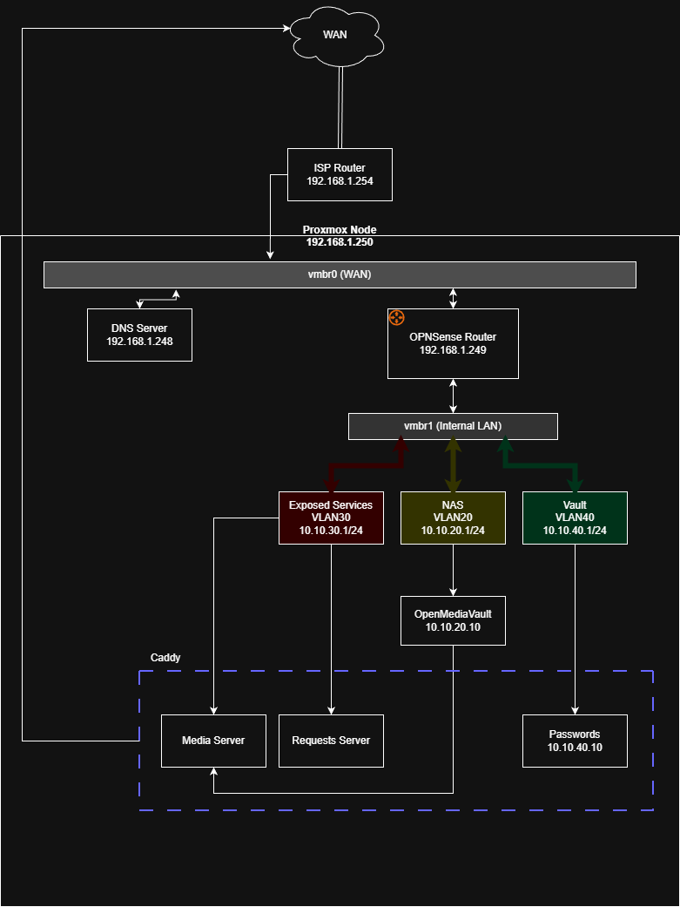

# Proxmox Homelab
My Current Setup of my Proxmox Homelab and what I have learned along the way.

## Why did I start this homelab?
I had just build a desktop that was quite powerful and decided that when I was not gaming, it was not being utilized. It started with plugging a 4TB WD Red Plus HDD into my desktop and hosting a media files and the server was sitting on bare metal Windows. Heres all the thoughts and changes I implemented since that point in time:

- I didn't like having the server on LAN only, so I started using Cloudflare Tunnel with cloudflared.
- Cloudflare ended up being slow, so I bought a domain and started using Caddy with DynamicDNS.
- My gaming desktop was stuttering due to the network traffic, so I bought a Lenovo Mini PC, and a 20TB Enterprise HDD and enclosure. I used Docker containers on Windows(terrible mistake) with GeoBlocking plugin on Caddy.
- I realized that read and write speeds were diminished due to the translation layer between Windows and WSL, so i back up the HDD, and converted everything to Linux(Ubuntu Server) and Ext4. 
- I learned about server hardening, install Crowdsec Log Parser and Firewall bouncer. I also created segmented docker networks, and gave each container the lowest permissions I could while maintaining stability.
- I learned docker containers aren't the way to go for true security, as they share the same kernel as the host. Thats when i learned about Proxmox Virtual Environment.

## My Network Setup.

## Security

### Crowdsec
I chose Crowdsec due to the fact that it provided a nice dashboard and is well documented. With Crowdsec I am able to have log parsers for Caddy to monitor for DDoS and DoS and probing attacks. Then I am able to have bruteforce log parsers for each service. 

Another key point that drew me to Crowdsec was that its community driven, if someone with a server gets hit by a malicous user, everyone on the Crowdsec network bans that IP address.

### VLANs

